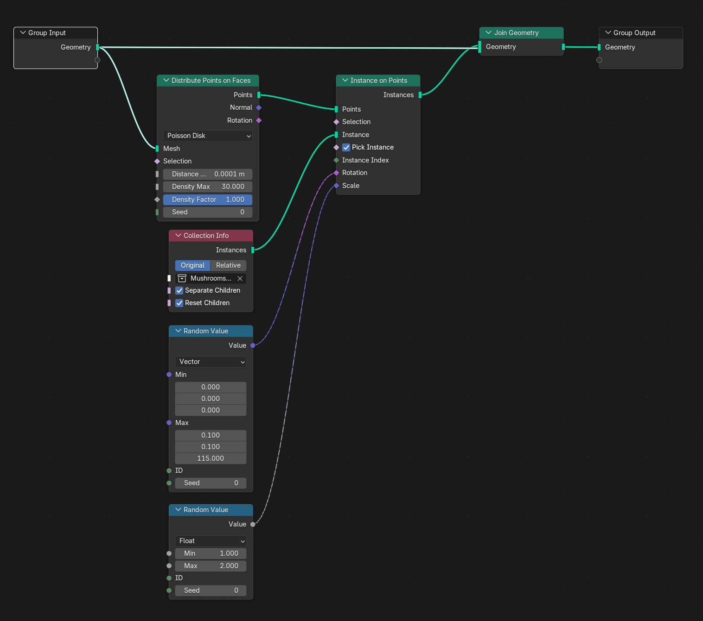

# Distribute Objects

- Using Geometry nodes to distribute objects on a another object
- Using Weight Paint to set how many objects appear in what areas of another object

# Setup

- Create object (using plane for example)
- Open Geometry nodes window in a split window
- Select plane and create a new geometry nodes in the geometry nodes window

# Single Object 

- Random vs. Poisson Disk
  - On the "Distribute Points on Faces" node
  - Random places randomly anywhere, can overlap other objects
  - Poisson Disk prevents objects overlapping
- Result Image:

# Multiple Objects

- Replace the "Object Info" node with the "Collection Info" node

# Weight Painting

- Create object
- Give object the basic geometry node setup

- Drag Density Factor out of "Distribute Points on Faces" into the Group Input
- Create Weight map
  - Select object
  - Click "Data" tab in properties
  - Create a new Vertex Group with the "+"
  - Name it
- Update density
  - Go to the Modifier tab for the object
  - Click "Input Attribute Toggle" button (looks like Denmark flag)
  - Click the blank bar and select the created input group
- Paint on the object
  - Open the "Weight Paint" tab (same drop down as object mode/edit mode)
  - Paint
  - Won't work on flat plane, it needs vertex points to work

